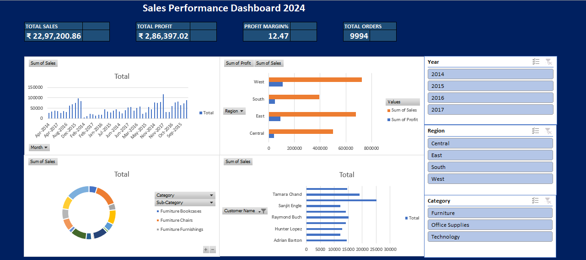
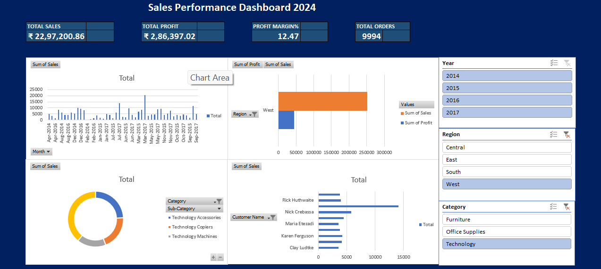
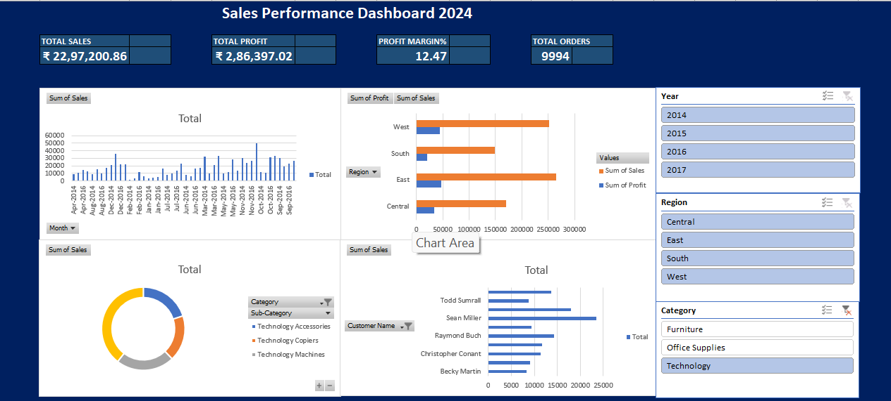

# 📊 Excel Sales Performance Dashboard

## Overview
Interactive sales dashboard built using Microsoft Excel with Pivot Tables,
Slicers, and Charts on the Superstore Sales dataset (9,994 orders).

## Tools Used
- Microsoft Excel
- Pivot Tables
- Slicers (Interactive Filters)
- Dynamic Charts
- KPI Cards

## Key Insights
- Total Sales: ₹22,97,200.86
- Total Profit: ₹2,86,397.02
- Profit Margin: 12.47%
- Total Orders: 9,994
- West region had the highest sales
- Technology category was most profitable

## Dashboard Preview

![Years].(Year.png)

## Dataset Source
Kaggle Superstore Sales Dataset
